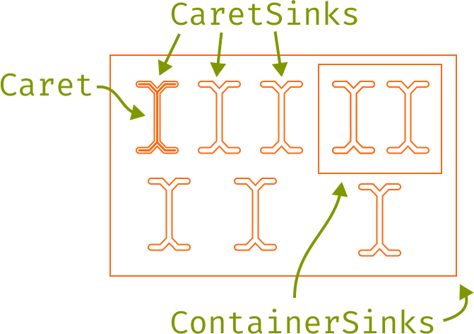

<path d="M14.82 45.3402C16.4 45.3402 17.87 45.0802 19.23 44.5602C20.61 44.0402 21.88 43.3802 23.04 42.5802L25.5 45.8802C24.12 47.0602 22.46 47.9902 20.52 48.6702C18.58 49.3502 16.68 49.6902 14.82 49.6902C11.68 49.6902 9 49.0202 6.78 47.6802C4.58 46.3202 2.9 44.4202 1.74 41.9802C0.58 39.5202 0 36.6402 0 33.3402C0 30.1802 0.58 27.3502 1.74 24.8502C2.92 22.3302 4.61 20.3502 6.81 18.9102C9.03 17.4702 11.72 16.7502 14.88 16.7502C16.9 16.7502 18.79 17.0602 20.55 17.6802C22.33 18.2802 23.96 19.1902 25.44 20.4102L22.98 23.7702C21.64 22.8302 20.29 22.1302 18.93 21.6702C17.59 21.1902 16.22 20.9502 14.82 20.9502C12.1 20.9502 9.86 21.9702 8.1 24.0102C6.34 26.0502 5.46 29.1602 5.46 33.3402C5.46 36.1402 5.86 38.4302 6.66 40.2102C7.48 41.9702 8.59 43.2702 9.99 44.1102C11.41 44.9302 13.02 45.3402 14.82 45.3402Z" fill="#F4672B"/>
<path d="M52.2366 42.1002C52.2366 43.3602 52.4466 44.2802 52.8666 44.8602C53.2866 45.4402 53.9366 45.8702 54.8166 46.1502L53.51 49.0002C52.15 48.8202 51.0366 49.0802 50.0166 48.4002C48.9966 47.7002 48.2566 46.6502 47.7966 45.2502C46.6566 46.7102 45.2366 47.8202 43.5366 48.5802C41.8366 49.3202 39.9566 49.6902 37.8966 49.6902C34.7366 49.6902 32.2466 48.8002 30.4266 47.0202C28.6066 45.2402 27.6966 42.8802 27.6966 39.9402C27.6966 36.6802 28.9666 34.1802 31.5066 32.4402C34.0466 30.7002 37.7166 29.8302 42.5166 29.8302H47.1666V27.1902C47.1666 24.9102 46.4966 23.3002 45.1566 22.3602C43.8366 21.4002 41.9966 20.9202 39.6366 20.9202C38.5966 20.9202 37.3766 21.0502 35.9766 21.3102C34.5766 21.5502 33.0566 21.9602 31.4166 22.5402L30.0966 18.7302C32.0366 18.0102 33.8566 17.5002 35.5566 17.2002C37.2566 16.9002 38.8766 16.7502 40.4166 16.7502C44.3566 16.7502 47.3066 17.6702 49.2666 19.5102C51.2466 21.3302 52.2366 23.8102 52.2366 26.9502V42.1002ZM39.1866 45.8502C40.7466 45.8502 42.2366 45.4602 43.6566 44.6802C45.0766 43.8802 46.2466 42.7802 47.1666 41.3802V33.2502H42.6066C39.1266 33.2502 36.6666 33.8502 35.2266 35.0502C33.8066 36.2502 33.0966 37.8602 33.0966 39.8802C33.0966 41.8402 33.5966 43.3302 34.5966 44.3502C35.6166 45.3502 37.1466 45.8502 39.1866 45.8502Z" fill="#F4672B"/>
<path d="M58.9931 49.0002V45.1302H63.9131V21.2802H58.9931V17.4102H67.7531L68.6831 24.8802C69.9031 22.2802 71.3831 20.2702 73.1231 18.8502C74.8631 17.4302 77.1631 16.7202 80.0231 16.7202C80.9031 16.7202 81.6831 16.7902 82.3631 16.9302C83.0631 17.0502 83.7731 17.2102 84.4931 17.4102L83.0231 21.9102C82.3631 21.7302 81.7631 21.6002 81.2231 21.5202C80.6831 21.4202 80.0631 21.3702 79.3631 21.3702C76.9431 21.3702 74.8631 22.2302 73.1231 23.9502C71.3831 25.6702 69.9931 28.2702 68.9531 31.7502V45.1302H75.3731V49.0002H58.9931ZM79.6331 28.0902V21.2202L80.1431 17.4102H84.4931L83.7731 28.0902H79.6331Z" fill="#F4672B"/>
<path d="M91.7297 34.9902C91.8297 37.4302 92.2997 39.4302 93.1397 40.9902C93.9797 42.5302 95.0897 43.6702 96.4697 44.4102C97.8497 45.1302 99.3497 45.4902 100.97 45.4902C102.59 45.4902 104.05 45.2502 105.35 44.7702C106.67 44.2902 108.02 43.5802 109.4 42.6402L111.77 45.9702C110.29 47.1302 108.6 48.0402 106.7 48.7002C104.82 49.3602 102.89 49.6902 100.91 49.6902C97.8497 49.6902 95.2397 49.0002 93.0797 47.6202C90.9197 46.2402 89.2697 44.3202 88.1297 41.8602C87.0097 39.3802 86.4497 36.5102 86.4497 33.2502C86.4497 30.0502 87.0197 27.2102 88.1597 24.7302C89.2997 22.2502 90.8997 20.3002 92.9597 18.8802C95.0197 17.4602 97.4497 16.7502 100.25 16.7502C102.91 16.7502 105.2 17.3802 107.12 18.6402C109.04 19.8802 110.51 21.6602 111.53 23.9802C112.57 26.2802 113.09 29.0302 113.09 32.2302C113.09 32.7702 113.08 33.2802 113.06 33.7602C113.04 34.2202 113.01 34.6302 112.97 34.9902H91.7297ZM100.31 20.8902C97.9697 20.8902 96.0097 21.7202 94.4297 23.3802C92.8697 25.0402 91.9797 27.6102 91.7597 31.0902H108.23C108.17 27.7102 107.43 25.1702 106.01 23.4702C104.59 21.7502 102.69 20.8902 100.31 20.8902Z" fill="#F4672B"/>
<path d="M100.01 3C100.01 3 111.4 3 116.383 5.23544C121.366 7.47088 121.366 12.5804 121.366 12.5804" stroke="#819700" stroke-width="5"/>
<path d="M142.01 3C142.01 3 130.62 3 125.637 5.23544C120.654 7.47088 120.654 12.5804 120.654 12.5804" stroke="#819700" stroke-width="5"/>
<path d="M99.81 56.5806C99.81 56.5806 111.2 56.5806 116.183 54.3451C121.166 52.1097 121.166 47.0001 121.166 47.0001" stroke="#E1D8BF" stroke-width="5"/>
<path d="M141.81 56.5806C141.81 56.5806 130.42 56.5806 125.437 54.3451C120.454 52.1097 120.454 47.0001 120.454 47.0001" stroke="#E1D8BF" stroke-width="5"/>
<path d="M120.783 50L118.51 11.7627H123.51L120.783 50Z" stroke="#F4672B" stroke-width="5.09091" stroke-linecap="round" stroke-linejoin="bevel"/>
<path d="M141.56 16.75C144.54 16.75 147.03 17.43 149.03 18.79C151.05 20.13 152.56 22.03 153.56 24.49C154.58 26.95 155.09 29.85 155.09 33.19C155.09 36.41 154.57 39.26 153.53 41.74C152.49 44.22 150.96 46.17 148.94 47.59C146.94 48.99 144.46 49.69 141.5 49.69C138.54 49.69 136.05 49.01 134.03 47.65C132.01 46.29 130.48 44.38 129.44 41.92C128.42 39.44 127.91 36.55 127.91 33.25C127.91 29.99 128.43 27.12 129.47 24.64C130.51 22.16 132.04 20.23 134.06 18.85C136.1 17.45 138.6 16.75 141.56 16.75ZM141.56 20.86C138.84 20.86 136.78 21.87 135.38 23.89C134 25.89 133.31 29.01 133.31 33.25C133.31 37.41 133.99 40.5 135.35 42.52C136.73 44.54 138.78 45.55 141.5 45.55C144.22 45.55 146.26 44.54 147.62 42.52C149 40.5 149.69 37.39 149.69 33.19C149.69 28.99 149.01 25.89 147.65 23.89C146.29 21.87 144.26 20.86 141.56 20.86Z" fill="#F4672B"/>
<path d="M172.737 16.75C175.537 16.75 177.767 17.43 179.427 18.79C181.107 20.15 182.317 22.07 183.057 24.55C183.797 27.01 184.167 29.89 184.167 33.19C184.167 36.37 183.717 39.21 182.817 41.71C181.937 44.19 180.597 46.14 178.797 47.56C176.997 48.98 174.727 49.69 171.987 49.69C168.527 49.69 165.747 48.47 163.647 46.03V61.09L158.607 61.72V17.41H162.897L163.317 21.82C164.477 20.2 165.857 18.95 167.457 18.07C169.077 17.19 170.837 16.75 172.737 16.75ZM171.537 20.8C169.797 20.8 168.257 21.33 166.917 22.39C165.597 23.43 164.507 24.59 163.647 25.87V41.53C164.467 42.75 165.497 43.72 166.737 44.44C167.997 45.14 169.377 45.49 170.877 45.49C173.497 45.49 175.467 44.49 176.787 42.49C178.107 40.49 178.767 37.38 178.767 33.16C178.767 30.4 178.507 28.11 177.987 26.29C177.467 24.45 176.677 23.08 175.617 22.18C174.557 21.26 173.197 20.8 171.537 20.8Z" fill="#F4672B"/>
<path d="M191.643 34.99C191.743 37.43 192.213 39.43 193.053 40.99C193.893 42.53 195.003 43.67 196.383 44.41C197.763 45.13 199.263 45.49 200.883 45.49C202.503 45.49 203.963 45.25 205.263 44.77C206.583 44.29 207.933 43.58 209.313 42.64L211.683 45.97C210.203 47.13 208.513 48.04 206.613 48.7C204.733 49.36 202.803 49.69 200.823 49.69C197.763 49.69 195.153 49 192.993 47.62C190.833 46.24 189.183 44.32 188.043 41.86C186.923 39.38 186.363 36.51 186.363 33.25C186.363 30.05 186.933 27.21 188.073 24.73C189.213 22.25 190.813 20.3 192.873 18.88C194.933 17.46 197.363 16.75 200.163 16.75C202.823 16.75 205.113 17.38 207.033 18.64C208.953 19.88 210.423 21.66 211.443 23.98C212.483 26.28 213.003 29.03 213.003 32.23C213.003 32.77 212.993 33.28 212.973 33.76C212.953 34.22 212.923 34.63 212.883 34.99H191.643ZM200.223 20.89C197.883 20.89 195.923 21.72 194.343 23.38C192.783 25.04 191.893 27.61 191.673 31.09H208.143C208.083 27.71 207.343 25.17 205.923 23.47C204.503 21.75 202.603 20.89 200.223 20.89Z" fill="#F4672B"/>
</svg>

<span style="float: right">[Part of the  project.](https://elliot.website/editor)</span>
<br><br><br>
⚠️ Unstable preview release ⚠️

# Spatial Caret Navigation

**Caretope** is a TypeScript/JavaScript library for working with spatial caret navigation. At a high level, it gives you two things:

1. An organizing structure for caret navigation that can be decoupled from document structure
2. A method that makes lines from spatial data that are "nice" for caret navigation

This means that regardless of how your document is represented (as a tree of nodes, or a list of characters, a graph, a hypergraph, whatever etc.), you can get
consistent caret navigation calculated from intuitive spatial properties.

---



At a practical level, **Caretope** provides three classes: **`Caret`**, and **`CaretSink`**, and **`ContainerSink`** (which both inherit from an abstract class **`Sink`**). Let's explain what all of these classes are:

Like we just said, `CaretSink`s and `ContainerSink`s are <strong>`Sink`</strong>s. Each `Sink` has a bounding box (top, bottom, left, and right positions). `Sink`s have methods for getting nearby `Sink`s. `Sink`s need a parent `ContainerSink` so **Caretope** can determine which `Sink`s are nearby.

A **`Caret`** is always at a certain `Sink` and can be moved left, right, up, or down to navigate to nearby `Sink`s.

A **`CaretSink`** represents a place that a `Caret` can be at.

A **`ContainerSink`** contains lines of `Sink`s. These lines are what **Caretope** uses to determine which `Sink`s are nearby which `Sink`s. The way this works is: `Sink`s can be added to a parent `ContainerSink` using `myContainerSink.addChild(sink)`. Then, `ContainerSink` provides a method `myContainerSink.calculateChildLines()` which organizes `Sink`s into lines in `myContainerSink.cachedLines` with nice spatial properties based on their bounding boxes. Each `ContainerSink` has settings for where `Caret`s should go when they navigate into the `ContainerSink` or when reaching the end of a line in the `ContainerSink`.

> ⚠️ The `calculateChildLines` method is currently too slow for realtime linearization with more than ~150 CaretSinks in a single ContainerSink. A workaround is to partition large ContainerSinks into multiple child ContainerSinks.

## Playground & Talk

### [CaretSink Visualizer Playground](https://vezwork.github.io/polylab/dist/demo/caretope/viscaretope)

[Source Code](./viscaretope.html)

### Presentation

[](https://www.youtube.com/watch?v=r--d5XlUyT4)<br>
["A Caret for Your Thoughts: Adapting Caret (Ꮖ) Navigation to Visual Editors" on YouTube.](https://www.youtube.com/watch?v=r--d5XlUyT4)

## How to use

This is an unstable preview release, so:

- please only use this for experimentation.
- to use this code, you currently have to copy&paste the following files into your Project:
  - [caretope_caret.ts](./caretope_caret.ts) and [caretope_sink.ts](./caretope_sink.ts);
  - or [caretope_caret.js](../../../dist/demo/caretope/caretope_caret.js) and [caretope_sink.js](../../../dist/demo/caretope/caretope_sink.js)

<details>
  <summary><strong>API Documentation</strong></summary>

### [`CaretSink`](./caretope_sink.ts)

```ts
const sink = new CaretSink(() => ({
  top: 10,
  left: 0,
  right: 2,
  bottom: 30,
}));

// CaretSink and ContainerSink shared methods
sink.leftSibling(): CaretSink | null
sink.leftmostSibling(): CaretSink | null
sink.rightSibling(): CaretSink | null
sink.rightmostSibling(): CaretSink | null
sink.upSibling(carryX?: number): CaretSink | null
sink.downSibling(carryX?: number): CaretSink | null
sink.line(): CaretSink[]
```

Why is the argument to the `CaretSink` constructor a function? idk tbh lol

### [`ContainerSink`](./caretope_sink.ts)

```ts
const container = new ContainerSink(() => ({
  top: 0,
  left: 0,
  right: 100,
  bottom: 0,
}));
// ContainerSink specific
container.isLinesWrapped = true;
container.enterBehaviour = "topLeft"; // or "nearest"

container.addChild(sink);
container.calculateChildLines(); // call this whenever children are added or their bounding boxes change

// CaretSink and ContainerSink shared methods
container.leftSibling(): CaretSink | null
container.leftmostSibling(): CaretSink | null
container.rightSibling(): CaretSink | null
container.rightmostSibling(): CaretSink | null
container.upSibling(carryX?: number): CaretSink | null
container.downSibling(carryX?: number): CaretSink | null
container.line(): CaretSink[]
```

### [`Caret`](./caretope_caret.ts)

```ts
const caret = new Caret(sink);
caret.isVerticalLinear = true;

document.addEventListener("keydown", (e) => {
  if (e.key === "ArrowLeft") caret.moveLeft();
  if (e.key === "ArrowRight") caret.moveRight();
  if (e.key === "ArrowUp") caret.moveUp();
  if (e.key === "ArrowDown") caret.moveDown();
});

const cur = caret.currentCaretSink;
```

</details>

## License

## Contributing

## Issues

- functional version
  - additional feature: non-instantiated Sinks
- ineffecient automatic CaretSink linearization
- not accessible
- poor documentation
- how to distribute
- publish interactive version of presentation
